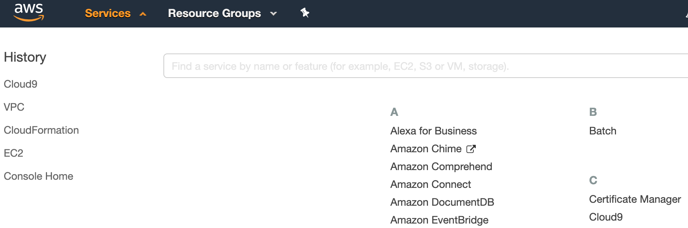
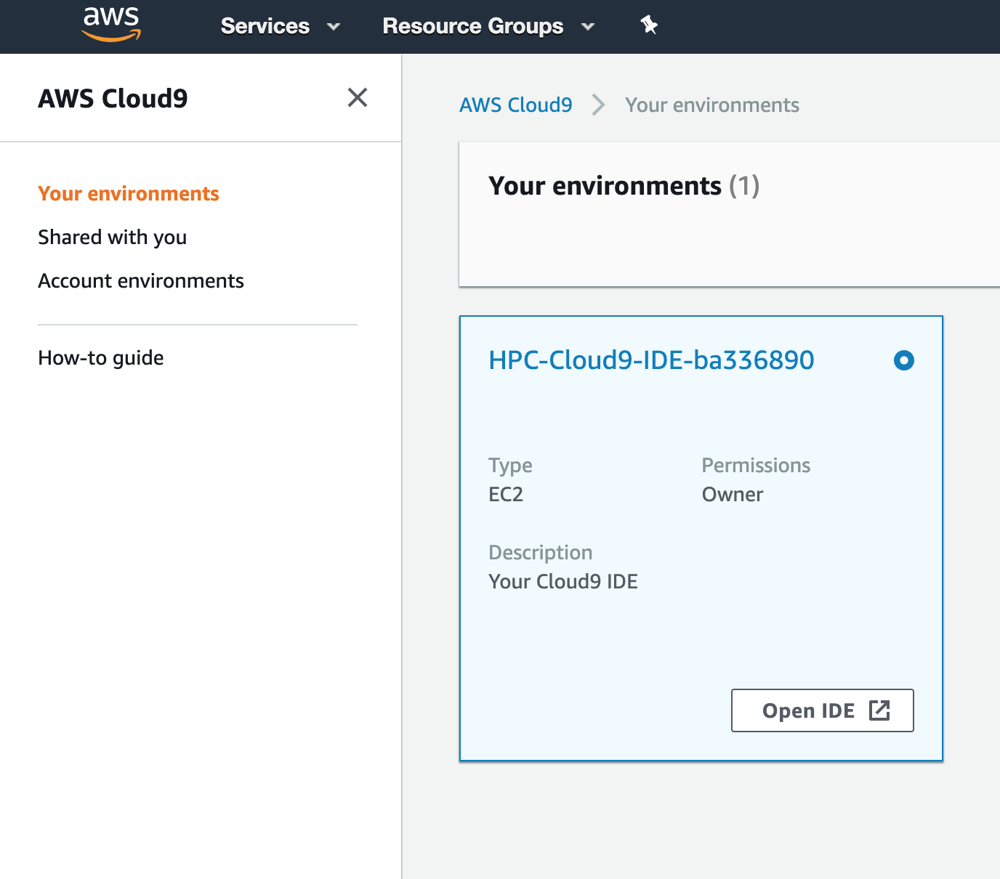
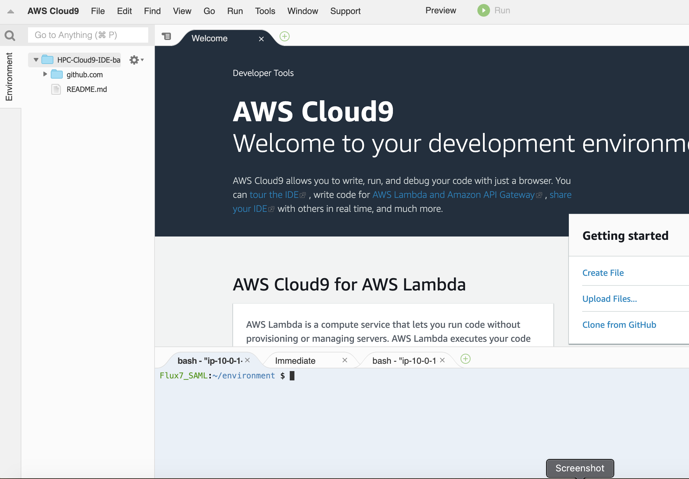
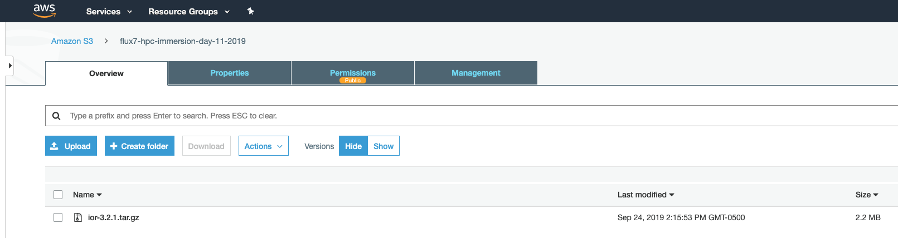
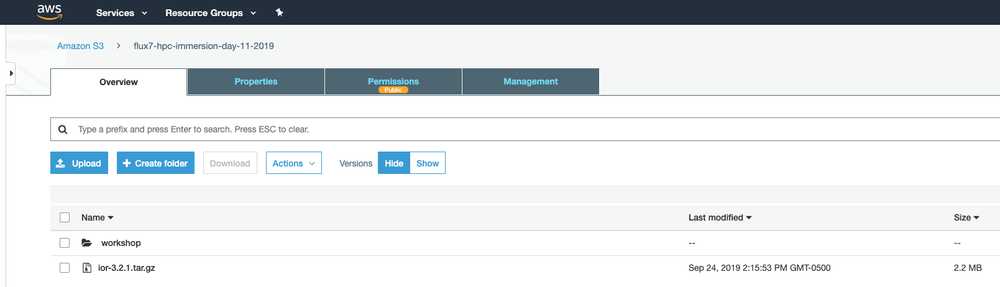

# AWS HPC Workshop
---
## Log in to your Console
1. Click "Services" and search for **Cloud9**



2.  Open the IDE

(insert image of IDE button)
##### Note:  You Must enable third party cookies in your browser for this to work properly

Your screen will look like this:



## Set in to your Python Virtual Environment

`source ~/pcluster-env/bin/activate`

Your command prompt should now look like this:

`(pcluster-env) ec2-user:~ $ `

## Now Create Your Cluster

`pcluster create mycluster`

This operation will take anywhere from 10-13 minutes.

## ssh into your cluster master to submit jobs

`(pcluster-env) ec2-user:~ $` **`pcluster ssh mycluster`**
```
Last login: Fri Oct  4 18:44:57 2019

       __|  __|_  )
       _|  (     /   Amazon Linux AMI
      ___|\___|___|

https://aws.amazon.com/amazon-linux-ami/2018.03-release-notes/
12 package(s) needed for security, out of 20 available
Run "sudo yum update" to apply all updates.
[ec2-user@ip-10-0-1-152 ~]$
```
## Go to the `/shared/AWS-HPC-Workshop` directory

`[ec2-user@ip-10-0-1-152 ~]$ ` **`cd /shared/AWS-HPC-Workshop`**

## Run the `submit.sh` command to submit 10 `job.sh` jobs

`[ec2-user@ip-10-0-1-152 ~]$  ` **`./submit.sh job.sh 10`**

You should see this:
```
Your job 1 ("job.sh") has been submitted
Your job 2 ("job.sh") has been submitted
Your job 3 ("job.sh") has been submitted
Your job 4 ("job.sh”) has been submitted
Your job 5 ("job.sh") has been submitted
Your job 6 ("job.sh") has been submitted
Your job 7 ("job.sh") has been submitted
Your job 9 ("job.sh") has been submitted
Your job 10 ("job.sh") has been submitted
```

## See your jobs in queue

```
job-ID  prior   name       user         state submit/start at     queue                          slots ja-task-ID
-----------------------------------------------------------------------------------------------------------------
      1 0.00000 job.sh     ec2-user     qw    10/01/2019 15:56:05                                    1        
      2 0.00000 job.sh     ec2-user     qw    10/01/2019 15:56:05                                    1        
      3 0.00000 job.sh     ec2-user     qw    10/01/2019 15:56:05                                    1        
      4 0.00000 job.sh     ec2-user     qw    10/01/2019 15:56:05                                    1        
      5 0.00000 job.sh     ec2-user     qw    10/01/2019 15:56:05                                    1        
      6 0.00000 job.sh     ec2-user     qw    10/01/2019 15:56:05                                    1        
      7 0.00000 job.sh     ec2-user     qw    10/01/2019 15:56:05                                    1        
      8 0.00000 job.sh     ec2-user     qw    10/01/2019 15:56:05                                    1        
      9 0.00000 job.sh     ec2-user     qw    10/01/2019 15:56:05                                    1        
     10 0.00000 job.sh     ec2-user     qw    10/01/2019 15:56:05                                    1                              
```

## Go back to the AWS Console and click EC2 and then Instances to see your intances spinning up



## When your jobs are done, see the output files in your home directory:

```
[ec2-user@ip-10-0-1-66 ~]$ cd
[ec2-user@ip-10-0-1-66 ~]$ ls -l
total 40
-rw-r--r-- 1 ec2-user ec2-user  0 Oct  1 16:00 job.sh.e1
-rw-r--r-- 1 ec2-user ec2-user  0 Oct  1 16:00 job.sh.e10
-rw-r--r-- 1 ec2-user ec2-user  0 Oct  1 16:00 job.sh.e2
-rw-r--r-- 1 ec2-user ec2-user  0 Oct  1 16:00 job.sh.e3
-rw-r--r-- 1 ec2-user ec2-user  0 Oct  1 16:00 job.sh.e4
-rw-r--r-- 1 ec2-user ec2-user  0 Oct  1 16:00 job.sh.e5
-rw-r--r-- 1 ec2-user ec2-user  0 Oct  1 16:00 job.sh.e6
-rw-r--r-- 1 ec2-user ec2-user  0 Oct  1 16:00 job.sh.e7
-rw-r--r-- 1 ec2-user ec2-user  0 Oct  1 16:00 job.sh.e8
-rw-r--r-- 1 ec2-user ec2-user  0 Oct  1 16:00 job.sh.e9
-rw-r--r-- 1 ec2-user ec2-user 35 Oct  1 16:00 job.sh.o1
-rw-r--r-- 1 ec2-user ec2-user 35 Oct  1 16:00 job.sh.o10
-rw-r--r-- 1 ec2-user ec2-user 35 Oct  1 16:00 job.sh.o2
-rw-r--r-- 1 ec2-user ec2-user 35 Oct  1 16:00 job.sh.o3
-rw-r--r-- 1 ec2-user ec2-user 35 Oct  1 16:00 job.sh.o4
-rw-r--r-- 1 ec2-user ec2-user 35 Oct  1 16:00 job.sh.o5
-rw-r--r-- 1 ec2-user ec2-user 35 Oct  1 16:00 job.sh.o6
-rw-r--r-- 1 ec2-user ec2-user 35 Oct  1 16:00 job.sh.o7
-rw-r--r-- 1 ec2-user ec2-user 35 Oct  1 16:00 job.sh.o8
-rw-r--r-- 1 ec2-user ec2-user 35 Oct  1 16:00 job.sh.o9
```
## You can see the output and that jobs ran on different hosts
```
[ec2-user@ip-10-0-1-66 ~]$ cat job.sh.o1
This job executed on ip-10-0-1-125


[ec2-user@ip-10-0-1-66 ~]$ cat job.sh.o2
This job executed on ip-10-0-1-231
```
## Now, let's submit an MPI run

```
[ec2-user@ip-10-0-1-66 AWS-HPC-Workshop]$ cd /shared/AWS-HPC-Workshop/
[ec2-user@ip-10-0-1-66 AWS-HPC-Workshop]$ qsub mpirun.sh
Your job 11 ("mpirun.sh") has been submitted


[ec2-user@ip-10-0-1-66 AWS-HPC-Workshop]$ qstat
job-ID  prior   name       user         state submit/start at     queue                          slots ja-task-ID
-----------------------------------------------------------------------------------------------------------------
     11 0.00000 mpirun.sh  ec2-user     qw    10/01/2019 16:14:29                                    1        
```
## Now, watch a large-ish file get written:
```
[ec2-user@ip-10-0-1-224 AWS-HPC-Workshop]$ cd /shared/AWS-HPC-Workshop/

[ec2-user@ip-10-0-1-224 AWS-HPC-Workshop]$ ./dd.sh /fsx/dd.out 4096
4275044352 bytes (4.3 GB) copied, 22.068620 s, 194 MB/s
4096+0 records in
4096+0 records out
4294967296 bytes (4.3 GB) copied, 22.1729 s, 194 MB/s
```
Notice the speed of the writes to the FSx for Lustre partition.  FSx for Lustre is a managed Lustre filesystem that scales with the size of the partition you create.  The filesystem really excels at high speed scratch space.  And, just like scratch space on-premise, it is not as durable.

## Finally, see how FSx for Lustre can write back data to S3 for durable storage
### Start by going to the console, selecting S3 and looking at your S3 bucket



## Use the provided script to write back the contents of your `/fsx` directory to S3
```
[ec2-user@ip-10-0-1-224 AWS-HPC-Workshop]$ ls -al /fsx
total 4133638
drwxrwxrwt  3 root     root          25088 Oct  1 19:23 .
dr-xr-xr-x 28 root     root           4096 Oct  1 19:07 ..
-rw-rw-r--  1 ec2-user ec2-user 4294967296 Oct  1 19:23 dd.out
-rwxr-xr-x  1 root     root        2263040 Sep 24 19:15 ior-3.2.1.tar.gz
[ec2-user@ip-10-0-1-224 AWS-HPC-Workshop]$ ./archive.sh
[ec2-user@ip-10-0-1-224 AWS-HPC-Workshop]$ nohup: ignoring input and redirecting stderr to stdout
```
## Now go back to your S3 bucket and look for the "workshop" folder


